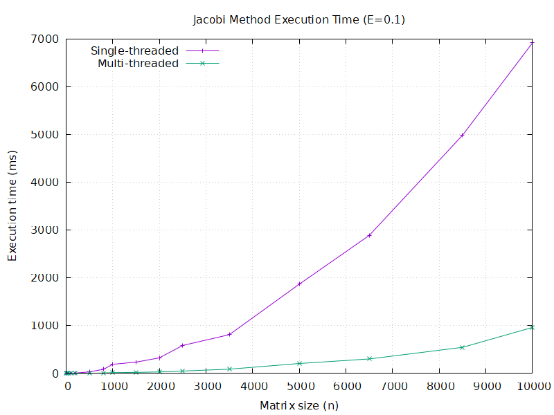
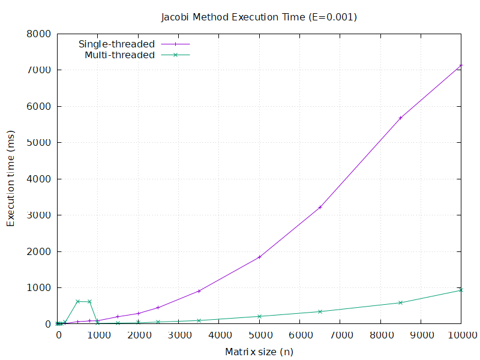
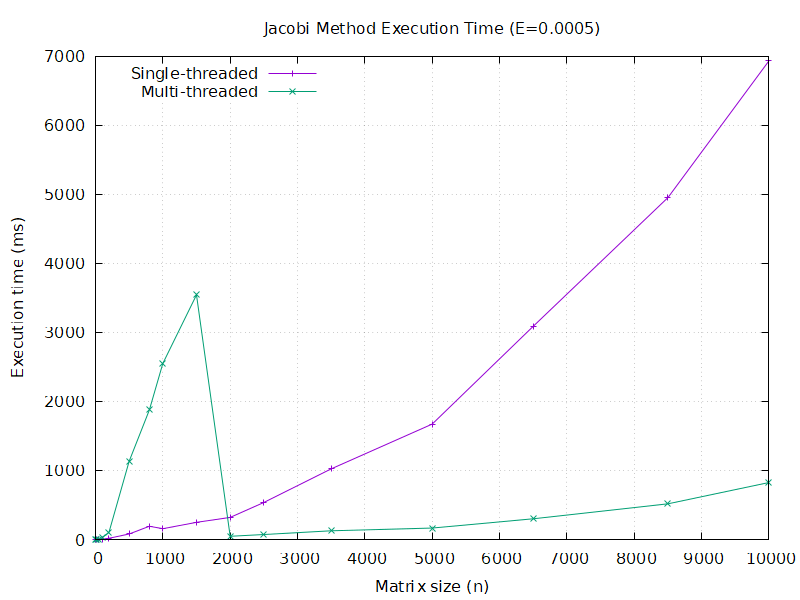
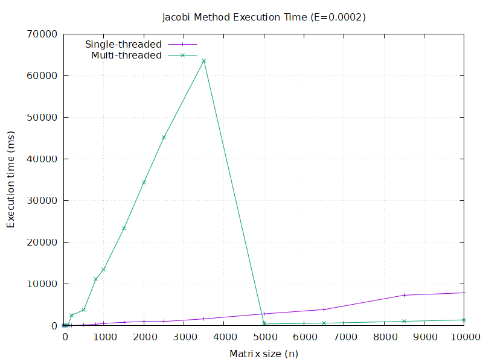

# Результати роботи методу Якобі

## 1. Графік залежностей коду Е = 0.1

_Опис: Графік показує відношення швидкості роботи однопоточного і багатопоточного алгоритму залежно від розміру матриці при похибці E = 0.1._

## Статистика експериментів

| n    | SingleThreaded (сек) | MultiThreaded (сек) | TimeDifference |
|------|----------------------|---------------------|----------------|
| 5    | 0.0702                | 0.1336              | 0.525449       |
| 10   | 0.1249                | 0.0848              | 1.47288        |
| 50   | 0.7485                | 0.6142              | 1.21866        |
| 100  | 2.6656                | 0.8197              | 3.25192        |
| 200  | 7.7131                | 0.7298              | 10.5688        |
| 500  | 32.816                | 2.6849              | 12.2224        |
| 800  | 86.0424               | 9.9413              | 8.65505        |
| 1000 | 191.842               | 16.5749             | 11.5743        |
| 1500 | 237.19                | 22.6916             | 10.4528        |
| 2000 | 326.767               | 31.324              | 10.4318        |
| 2500 | 586.351               | 49.9666             | 11.7349        |
| 3500 | 811.578               | 89.4913             | 9.06879        |
| 5000 | 1869.26               | 208.416             | 8.96887        |
| 6500 | 2888.95               | 303.309             | 9.52477        |
| 8500 | 4986.05               | 546.826             | 9.11817        |
| 10000| 6919.49               | 963.565             | 7.18113        |

## 2. Графік залежностей для Е = 0.01

## Статистика експериментів

|   n   | SingleThreaded (сек) | MultiThreaded (сек) | TimeDifference |
|-------|----------------------|---------------------|----------------|
|    5  |                0.076 |              0.1029 |        0.738581 |
|   10  |               0.1719 |              0.1243 |        1.38294  |
|   50  |               1.8113 |              6.1038 |        0.29675  |
|  100  |               6.4343 |              7.875  |        0.817054 |
|  200  |              11.7495 |              2.2791 |        5.15532  |
|  500  |              34.2644 |              3.1903 |       10.7402   |
|  800  |              91.7306 |             10.0547 |        9.12316  |
| 1000  |             125.891  |             17.1146 |        7.3558   |
| 1500  |             254.236  |             32.2157 |        7.89169  |
| 2000  |             315.513  |            100.612  |        3.13596  |
| 2500  |             505.981  |             51.2082 |        9.88086  |
| 3500  |             808.301  |             87.7086 |        9.21575  |
| 5000  |            1747.28   |            179.034  |        9.75944  |
| 6500  |            2991.56   |            364.06   |        8.21721  |
| 8500  |            4917.45   |            566.038  |        8.68748  |
|10000  |            6727.76   |            831.473  |        8.09137  |

## 3. Графік залежностей для Е = 0.001

## Статистика експериментів

|   n   | SingleThreaded (сек) | MultiThreaded (сек) | TimeDifference |
|-------|----------------------|---------------------|----------------|
|    5  |               0.0879  |              0.1527 |        0.575639 |
|   10  |               0.1657  |              0.2030 |        0.816256 |
|   50  |               1.8499  |              2.8331 |        0.652960 |
|  100  |               5.2351  |              8.5469 |        0.612514 |
|  200  |              16.0924  |             53.7572 |        0.299353 |
|  500  |              61.3697  |            617.5910 |        0.099369 |
|  800  |              82.4259  |            612.2210 |        0.134634 |
| 1000  |              89.6312  |             15.4388 |        5.805580 |
| 1500  |             198.6780  |             24.2850 |        8.181120 |
| 2000  |             287.9130  |             31.6861 |        9.086400 |
| 2500  |             450.0420  |             52.6310 |        8.550900 |
| 3500  |             906.0740  |             94.1376 |        9.625000 |
| 5000  |            1839.3200  |            208.3520 |        8.827950 |
| 6500  |            3211.3200  |            340.0170 |        9.444570 |
| 8500  |            5684.5000  |            585.2600 |        9.712780 |
|10000  |            7135.8800  |            929.5650 |        7.676580 |

## 4. Графік залежностей для Е = 0.0005

## Статистика експериментів

|   n   | SingleThreaded (сек) | MultiThreaded (сек) | TimeDifference |
|-------|----------------------|---------------------|----------------|
|    5  |               0.0625  |              0.1594 |        0.392095 |
|   10  |               0.1476  |              0.1982 |        0.744702 |
|   50  |               2.1022  |              2.7659 |        0.760042 |
|  100  |               8.9593  |             32.9748 |        0.271701 |
|  200  |              23.4965  |            108.8470 |        0.215868 |
|  500  |              85.8820  |           1138.3600 |        0.075444 |
|  800  |             197.2510  |           1880.6500 |        0.104885 |
| 1000  |             162.2510  |           2554.0200 |        0.063528 |
| 1500  |             254.3930  |           3547.0400 |        0.071720 |
| 2000  |             325.8370  |             52.3160 |        6.228250 |
| 2500  |             542.3130  |             77.9566 |        6.956600 |
| 3500  |            1028.6500  |            131.8940 |        7.799100 |
| 5000  |            1676.9700  |            171.6170 |        9.771560 |
| 6500  |            3092.5300  |            305.8380 |       10.111700 |
| 8500  |            4955.5900  |            522.4730 |        9.484870 |
|10000  |            6935.2800  |            830.9390 |        8.346310 |

## 5. Графік залежностей для Е = 0.0005

## Статистика експериментів

|   n   | SingleThreaded (сек) | MultiThreaded (сек) | TimeDifference |
|-------|----------------------|---------------------|----------------|
|    5  |               0.1419  |              0.2138 |        0.663704 |
|   10  |               0.3113  |              0.5808 |        0.535985 |
|   50  |               3.3501  |             32.7201 |        0.102387 |
|  100  |              12.8758  |             52.2266 |        0.246537 |
|  200  |              39.3569  |           2526.5400 |        0.015577 |
|  500  |             155.0430  |           3827.2800 |        0.040510 |
|  800  |             378.1280  |          11153.2000 |        0.033903 |
| 1000  |             542.7790  |          13566.5000 |        0.040009 |
| 1500  |             833.3010  |          23308.6000 |        0.035751 |
| 2000  |            1010.4800  |          34405.6000 |        0.029370 |
| 2500  |            1025.3100  |          45179.3000 |        0.022694 |
| 3500  |            1648.0100  |          63626.6000 |        0.025901 |
| 5000  |            2851.9500  |            428.1370 |        6.661300 |
| 6500  |            3893.4100  |            615.5630 |        6.324950 |
| 8500  |            7326.9700  |           1053.5600 |        6.954480 |
|10000  |            7902.9900  |           1410.7500 |        5.601990 |
